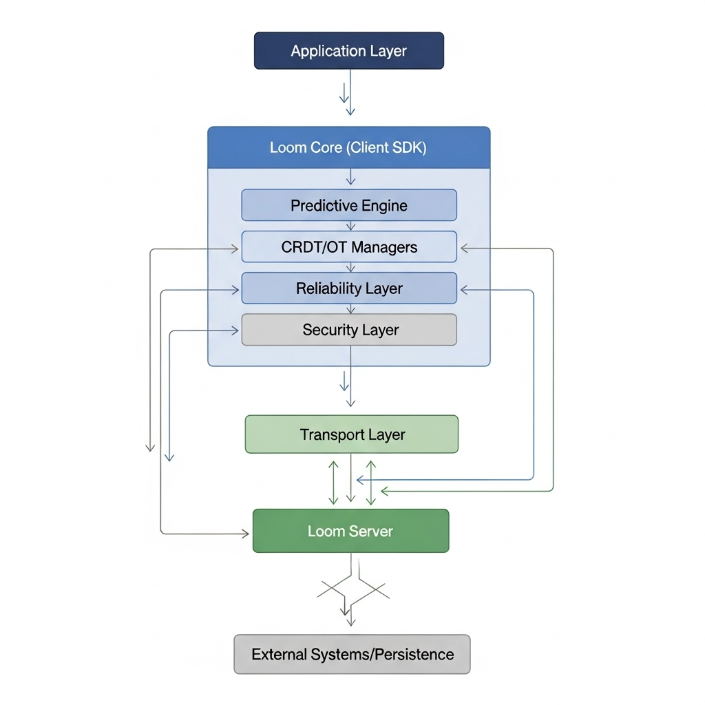
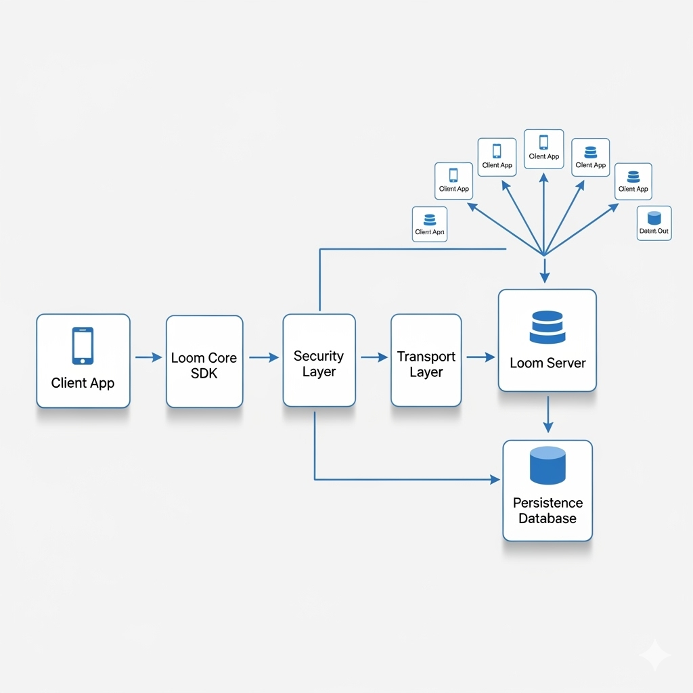

# Loom [EN](./README.md)

Loom adalah library realtime super cepat, ringan, dan aman untuk sinkronisasi data antar client dan service. ✨

Loom dibangun atas prinsip bahwa data real-time harus cepat, konsisten, dan aman di semua lingkungan. Dirancang sebagai fondasi komunikasi yang sederhana namun kuat, memungkinkan aplikasi tetap sinkron meskipun kondisi jaringan tidak stabil. Fokus pada efisiensi, reliabilitas, dan keamanan. 🔒⚡



---

## 🧠 Filosofi

**Loom**, yang berarti *mesin tenun*, mencerminkan filosofi desainnya: menyatukan data secara mulus, menjaga konsistensi, dan memastikan keamanan komunikasi real-time di seluruh perangkat dan jaringan yang berbeda.

Setiap lapisan di Loom dirancang untuk menyeimbangkan kecepatan, keandalan, dan keamanan tanpa membebani aplikasi. Loom bukan hanya alat untuk bertukar pesan, tapi fondasi untuk segala bentuk interaksi real-time. ⚡💬



---

## ⭐ Fitur Utama

* ⏱️ Latensi Ultra Rendah
* 🌐 Universal
* 🔄 Adaptif
* 💾 Persistence
* 🔁 Auto Retry & Reliability
* 🧩 CRDT + OT
* 🤖 Predictive Engine
* 🚚 Transport
* 🔐 Enkripsi AES-GCM

---

## 💿 Instalasi

```bash
npm install loom
```

---

## 🔧 Penggunaan Loom

### Server (Node.js)

```javascript
// ESM
import { LoomServer } from "loom/esm/LoomServer.js";

LoomServer.getInstance({
  host: "localhost",
  port: 8080,
  debug: true
});
```

---

### Klien

#### a) Inisialisasi & Konfigurasi

```javascript
const loom = new Loom({
  url: "ws://localhost:8080",      // Alamat server Loom
  clientId: "User-demo",           // Identitas klien
  encryption: false,               // Enkripsi data opsional
  encryptionKey: "my-secret-key",  // Kunci enkripsi opsional
  predictive: false,               // Mesin prediktif opsional
  history: false,                  // Simpan buffer lokal
  transport: "websocket"           // websocket | quic (segera hadir)
});
```

#### b) ESM (Node.js / Modern bundler)

```javascript
import { Loom } from "loom/esm/Loom.js";

const loom = new Loom({
  url: "ws://localhost:8080",
  clientId: `esm-${Math.floor(Math.random() * 1000)}`,
  transport: "websocket", // "websocket" | "quic"
  history: false,
  encryption: false
});

// Subscribe ke event
loom.on("default", msg => {
  const d = msg.data || msg;
  console.log(`[ESM] ${d.clientId}: ${d.message}`);
});

// Jalankan koneksi
loom.connect();

// Kirim data setiap 2 detik
setInterval(() => {
  loom.send("default", { message: "Hello from ESM client" });
}, 2000);
```

#### c) CJS (Node.js dengan require)

```javascript
const { Loom } = require("loom/cjs/Loom.cjs");

const loom = new Loom({
  url: "ws://localhost:8080",
  clientId: `cjs-${Math.floor(Math.random() * 1000)}`,
  transport: "websocket",
  history: false,
  encryption: false
});

loom.on("default", msg => {
  const d = msg.data || msg;
  console.log(`[CJS] ${d.clientId}: ${d.message}`);
});

loom.connect();

setInterval(() => {
  loom.send("default", { message: "Hello from CJS client" });
}, 2000);
```

#### d) Browser / UMD

```html
<script src="https://cdn.jsdelivr.net/gh/FhyLabs/loom@v1.0.0/loom.umd.js"></script>
<script>
  const loom = new Loom({
    url: "ws://localhost:8080",
    clientId: `browser-${Math.floor(Math.random() * 1000)}`,
    transport: "websocket"
  });

  loom.on("default", msg => {
    const d = msg.data || msg;
    console.log(`[Browser] ${d.clientId}: ${d.message}`);
  });

  loom.connect();

  setInterval(() => {
    loom.send("default", { message: "Hello from Browser client" });
  }, 2000);
</script>
```

---

### Operasi Global (berlaku untuk semua klien)

```javascript
// Subscribe ke event
loom.on("chat", (msg: any) => {
  const d = msg.data || msg;
  addMessage(d.clientId, d.message);
});

// Kirim data ke channel
loom.send("chat", { message: "hello world!" });

// Render buffer lokal
loom.renderBufferLocally();

// Bersihkan riwayat
loom.clearHistory();

// Hubungkan / putuskan koneksi
loom.connect();
loom.disconnect();
```

---

## 📋 Ringkasan API

| Method / Event                        | Parameter                                              | Keterangan                                                             |
| ------------------------------------- | ------------------------------------------------------ | ---------------------------------------------------------------------- |
| `loom.connect()`                      | –                                                      | Membuka koneksi ke server.                                             |
| `loom.disconnect()`                   | –                                                      | Menutup koneksi manual.                                                |
| `loom.on(event, callback)`            | `event: string`, `callback: (msg, clientId)`           | Subscribe ke event tertentu.                                           |
| `loom.send(channel, data, receiver?)` | `channel: string`, `data: object`, `receiver?: string` | Mengirim data ke channel tertentu.                                     |
| `loom.renderBufferLocally()`          | `event?: string` (opsional)                            | Merender ulang semua pesan yang tersimpan di buffer lokal.             |
| `loom.clearHistory()`                 | –                                                      | Menghapus semua buffer lokal.                                          |
| `loom.persistence.getAll()`           | –                                                      | Mengambil semua riwayat pesan dari buffer lokal.                       |
| `loom.isConnected()` *(opsional)*     | –                                                      | Bisa ditambahkan jika perlu return status koneksi (tidak ada default). |

---

## 🌎 Pola Penggunaan Global

1. **Inisialisasi klien** dengan opsi sesuai kebutuhan (`clientId`, `encryption`, `history`, dll).
2. **Daftar event** dengan `loom.on("event-name", callback)`.
3. **Kirim data** dengan `loom.send("event-name", payload)`.
4. **Hubungkan ke server** dengan `loom.connect()`.
5. (Opsional) gunakan `renderBufferLocally()` atau `clearHistory()` jika pakai buffer lokal.

---

## 🎯 Use Case Umum

* 💬 **Chatting** → event: `"chat"`, payload: `{ message }`
* 📄 **Dokumen Sync (CRDT/OT)** → event: `"doc-update"`, payload: `{ delta }`
* 🌡️ **IoT/Dashboard** → event: `"sensor-data"`, payload: `{ temp, hum }`
* 🎮 **Game Multiplayer** → event: `"player-move"`, payload: `{ x, y, action }`
* 🔔 **Notifikasi** → event: `"notification"`, payload: `{ title, message }`
* 🗳️ **Polling/Voting** → event: `"poll-vote"`, `"poll-result"`

---

## 💡 Catatan

* **CJS client**: akses file `.cjs` di `loom/cjs/`
* **ESM client**: akses file `.js` di `loom/esm/`
* **Browser**: gunakan **UMD** (`loom/loom.umd.js`)