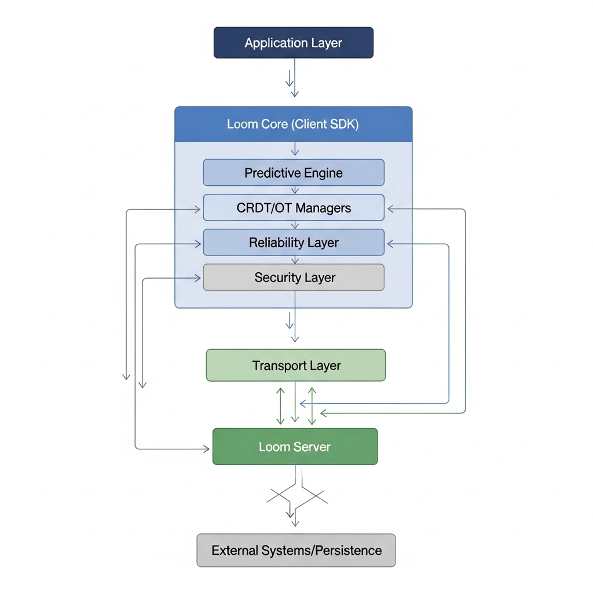

# Loom [ID](./README-ID.md)

Loom is a super-fast, lightweight, and secure real-time library for data synchronization between clients and services. ✨

Loom is built on the principle that real-time data should be fast, consistent, and secure across all environments. It's designed as a simple yet robust communications foundation, enabling applications to stay in sync even under unstable network conditions. Focused on efficiency, reliability, and security. 🔒⚡



---

## 🧠 Philosophy

Loom, meaning *loom*, reflects its design philosophy: seamlessly unifying data, maintaining consistency, and ensuring secure real-time communications across disparate devices and networks.

Each layer in Loom is designed to balance speed, reliability, and security without burdening the application. Loom is not just a messaging tool, but the foundation for all forms of real-time interaction. ⚡💬


---

## ⭐ Key Features

* ⏱️ Ultra-Low Latency
* 🌐 Universal
* 🔄 Adaptive
* 💾 Persistence
* 🔁 Auto Retry & Reliability
* 🧩 CRDT + OT
* 🤖 Predictive Engine
* ​​🚚 Transport
* 🔐 AES-GCM Encryption

---

## 💿 Installation

```bash
npm i @fhylabs/loom
```

---

## 🔧 Loom Usage

### Server (Node.js)

```javascript
// ESM
import { LoomServer } from "@fhylabs/loom/esm/LoomServer.js";

LoomServer.getInstance({
  host: "localhost",
  port: 8080,
  debug: true
});
```

---

### Client

#### a) Initialization and Configuration

```javascript
const loom = new Loom({
  url: "ws://localhost:8080",     // Loom address server
  clientId: "User-demo",          // Client identity
  encryption: false,              // Data encryption (opsional)
  encryptionKey: "my-secret-key", // encryption key (opsional)
  predictive: false,              // predictive engine (opsional)
  history: false,                 // saves local buffers (opsional)
  transport: "websocket"          // websocket | quic (coming soon)
});
```

#### b) ESM (Node.js / Modern bundler)

```javascript
import { Loom } from "@fhylabs/loom/esm/Loom.js";

const loom = new Loom({
  url: "ws://localhost:8080",
  clientId: `esm-${Math.floor(Math.random() * 1000)}`,
  transport: "websocket", // "websocket" | "quic"
  history: false,
  encryption: false
});

// Subscribe to the event
loom.on("default", msg => {
  const d = msg.data || msg;
  console.log(`[ESM] ${d.clientId}: ${d.message}`);
});

// Run connection
loom.connect();

// Send data every 2 seconds
setInterval(() => {
  loom.send("default", { message: "Hello from ESM client" });
}, 2000);
```

#### c) CJS (Node.js with require)

```javascript
const { Loom } = require("@fhylabs/loom/cjs/Loom.cjs");

const loom = new Loom({
  url: "ws://localhost:8080",
  clientId: `cjs-${Math.floor(Math.random() * 1000)}`,
  transport: "websocket",
  history: false,
  encryption: false
});

loom.on("default", msg => {
  const d = msg.data || msg;
  console.log(`[CJS] ${d.clientId}: ${d.message}`);
});

loom.connect();

setInterval(() => {
  loom.send("default", { message: "Hello from CJS client" });
}, 2000);
```

#### d) Browser / UMD

```html
<script src="https://cdn.jsdelivr.net/gh/FhyLabs/loom@v1.0.0/loom.umd.js"></script>
<script>
  const loom = new Loom({
    url: "ws://localhost:8080",
    clientId: `browser-${Math.floor(Math.random() * 1000)}`,
    transport: "websocket"
  });

  loom.on("default", msg => {
    const d = msg.data || msg;
    console.log(`[Browser] ${d.clientId}: ${d.message}`);
  });

  loom.connect();

  setInterval(() => {
    loom.send("default", { message: "Hello from Browser client" });
  }, 2000);
</script>
```

---

### Global Operations (applies to all clients)

```javascript
// Subscribe to the event
loom.on("chat", (msg: any) => {
  const d = msg.data || msg;
  addMessage(d.clientId, d.message);
});

// Send data to channel
loom.send("chat", { message: "hello world!" });

// Render local buffer
loom.renderBufferLocally();

// Clear history
loom.clearHistory();

// Connect / disconnect connection
loom.connect();
loom.disconnect();
```

---

## 📋 API Overview

| Method / Event | Parameters | Description |
| ------------------------------------- | ------------------------------------------------------ | ---------------------------------------------------------------------- |
| `loom.connect()` | – | Opens a connection to the server. |
| `loom.disconnect()` | – | Closes a manual connection. |
| `loom.on(event, callback)` | `event: string`, `callback: (msg, clientId)` | Subscribe to a specific event. |
| `loom.send(channel, data, receiver?)` | `channel: string`, `data: object`, `receiver?: string` | Sends data to a specific channel. |
| `loom.renderBufferLocally()` | `event?: string` (optional) | Re-renders all messages stored in the local buffer. |
| `loom.clearHistory()` | – | Clears all local buffers. |
| `loom.persistence.getAll()` | – | Retrieves all message history from the local buffer. |
| `loom.isConnected()` *(optional)* | – | Can be added if needed to return the connection status (no default). |

---

## 🌎 Global Usage Pattern

1. **Initialize the client** with the necessary options (`clientId`, `encryption`, `history`, etc.).
2. **Register for events** with `loom.on("event-name", callback)`.
3. **Send data** with `loom.send("event-name", payload)`.
4. **Connect to the server** with `loom.connect()`.
5. (Optional) use `renderBufferLocally()` or `clearHistory()` if using a local buffer.

---

## 🎯 Common Use Cases

* 💬 **Chatting** → event: `"chat"`, payload: `{ message }`
* 📄 **Document Sync (CRDT/OT)** → event: `"doc-update"`, payload: `{ delta }`
* 🌡️ **IoT/Dashboard** → event: `"sensor-data"`, payload: `{ temp, hum }`
* 🎮 **Multiplayer Game** → event: `"player-move"`, payload: `{ x, y, action }`
* 🔔 **Notification** → event: `"notification"`, payload: `{ title, message }`
* 🗳️ **Polling/Voting** → event: `"poll-vote"`, `"poll-result"`

---

## 💡 Notes

* **CJS client**: access `.cjs` files in `@fhylabs/loom/cjs/`
* **ESM client**: access `.js` files in `@fhylabs/loom/esm/`
* **Browser**: use **UMD** (`https://cdn.jsdelivr.net/gh/FhyLabs/loom@v1.0.0/loom.umd.js`)